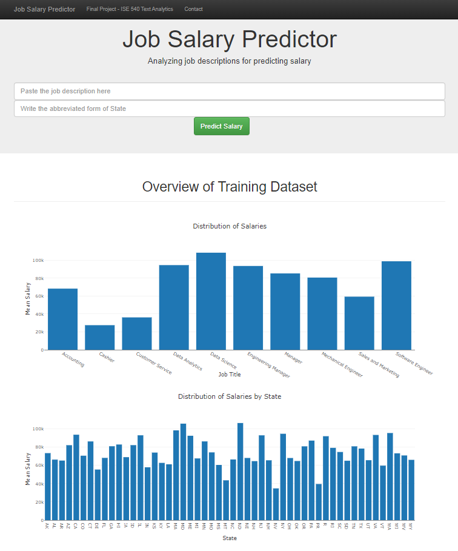
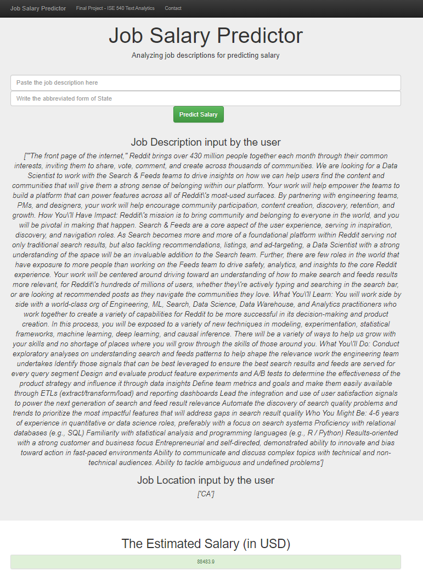

# Job Salary Prediction

### Overview
Our project aims to assist job seekers negotiate salaries by predicting what salary to expect for a certain job description at a given location. There are tens of thousands of jobs on online job boards that invite job seekers to apply for jobs without providing an estimate of the compensation they provide – this was further validated when we were scraping for salaries online. This poses a lot of problems for job seekers, especially new graduates like us, applying for a job role or when trying to negotiate the compensation. These problems are what we seek to solve in our project, where we train machine learning models to predict salaries for a job posting at a certain location in the United States. We, being job seekers, are facing this problem every day in our job hunt which gives us a strong motivation to build an efficient and reliable model to help us in finding the right compensation for our jobs.

### Description of files
- App: Contains HTML files and `app.py` file  which implements Flask & Plotly to create the web app
- Data: Contains two CSV files `disaster_messages.csv` - Contains all the past messages & 'disaster_categories.csv' - contains the categories of the disaster messages
- Model: Contains the Machine Learning Pipeline python script file to perform all the training and testing of the data

### List of Python libraries used
`nltk`
`sklearn`
`numpy`
`pandas`
`sys`
`re`
`pickle`
`json`
`flask`

### Instructions:
1. Run the following commands in the project's root directory to set up your database and model.

    - To run ETL pipeline that cleans data and stores in database
        `python data/process_data.py data/disaster_messages.csv data/disaster_categories.csv data/DisasterResponse.db`
    - To run ML pipeline that trains classifier and saves
        `python models/train_predictor.py data/Temp.csv models/predictor.pkl data/vocab.txt models/tfidf.pkl models/nmf.pkl`

2. Run the following command in the app's directory to run your web app.
    `python app/run.py`

3. Go to http://127.0.0.1:8080/ 

4. Link to the Github repo: https://github.com/akarshn95/Job_Salary_Prediction

### Snapshots

  
  

